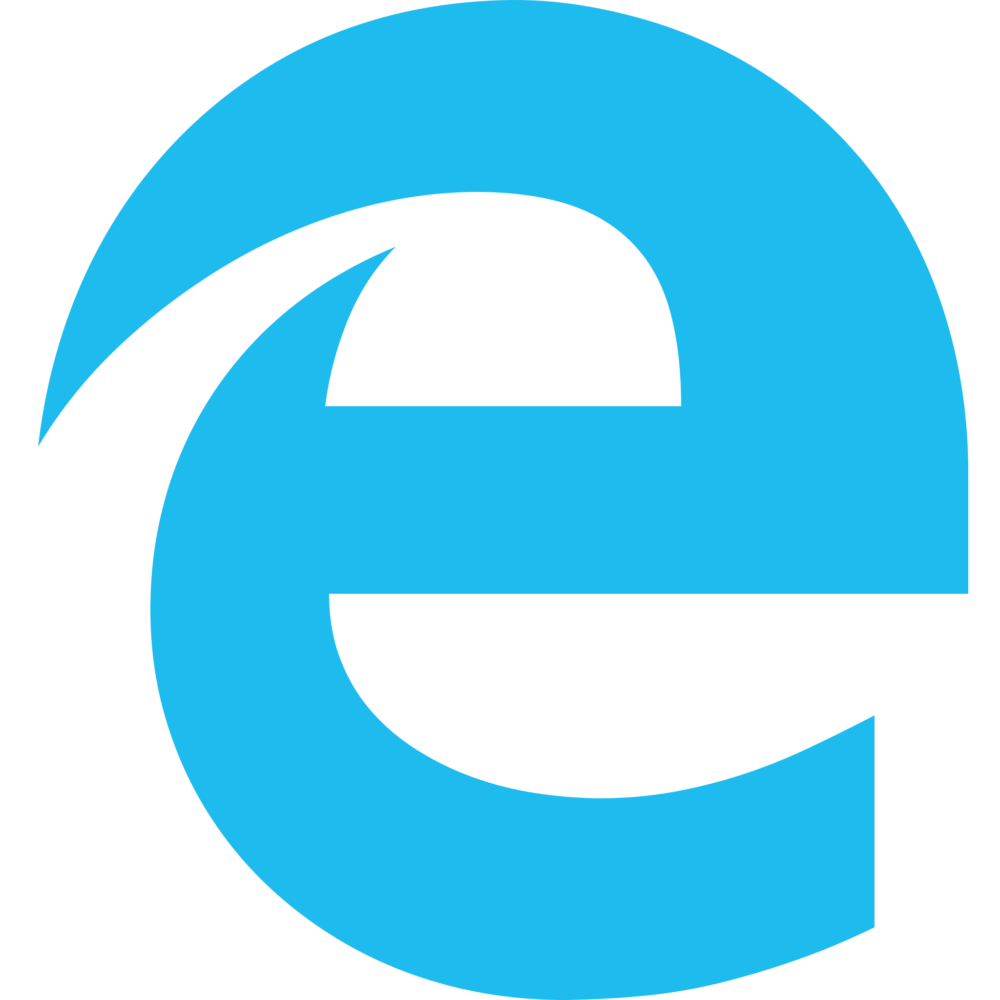
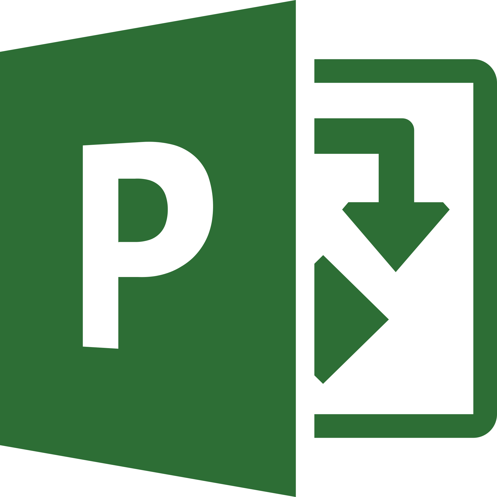
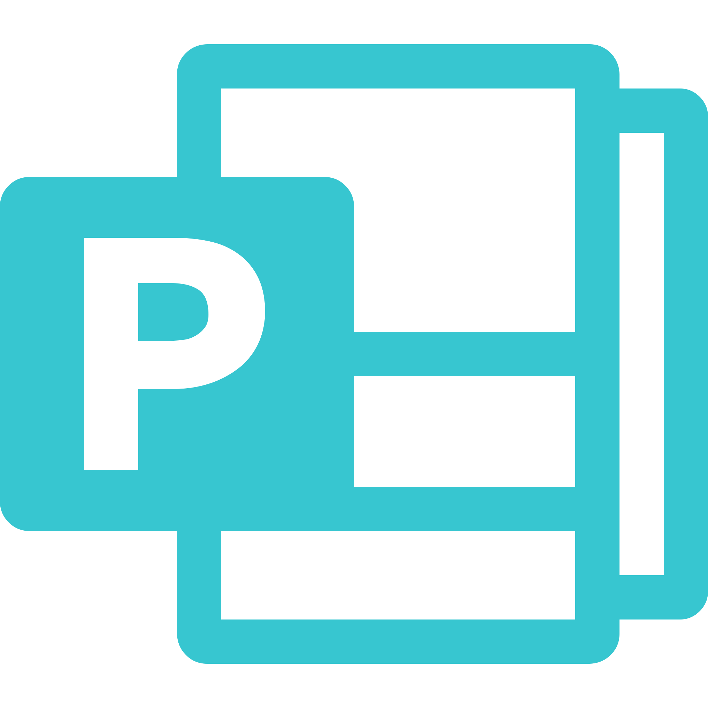

## Currently supported applications
### WinApps supports ***ANY*** installed application on your system.

It does this by:
1. Scanning your system for offically configured applications (below)
2. Scanning your system for any other EXE files with install records in the Windows Registry

Any officially configured applications will have support for high-resolution icons and mime types for automatically detecting what files can be opened by each application. Any other detected executable files will leverage the icons pulled from the EXE.

Note: The officially configured application list below is fueled by the community, and therefore some apps may be untested by the WinApps team.

<table cellpadding="10" cellspacing="0" border="0">
  <tr>
    <td></td><td>Adobe Acrobat Pro (X)</td>
    <td></td><td>Adobe Acrobat Reader (DC)</td>
  </tr>
  <tr>
    <td></td><td>Adobe After Effects (CC)</td>
    <td></td><td>Adobe Audition (CC)</td>
  </tr>
  <tr>
    <td></td><td>Adobe Bridge (CS6, CC)</td>
    <td></td><td>Adobe Creative Cloud (CC)</td>
  </tr>
  <tr>
    <td></td><td>Adobe Illustrator (CC)</td>
    <td></td><td>Adobe InDesign (CC)</td>
  </tr>
  <tr>
    <td></td><td>Adobe Lightroom (CC)</td>
    <td></td><td>Adobe Photoshop (CS6, CC)</td>
  </tr>
  <tr>
    <td></td><td>Adobe Premiere Pro (CC)</td>
    <td></td><td>Command Prompt (cmd.exe)</td>
  </tr>
  <tr>
    <td></td><td>Explorer (File Manager)</td>
    <td></td><td>Internet Explorer (11)</td>
  </tr>
  <tr>
    <td></td><td>Microsoft Access (2016, 2019, o365)</td>
    <td></td><td>Microsoft Excel (2016, 2019, o365)</td>
  </tr>
  <tr>
    <td></td><td>Microsoft Word (2016, 2019, o365)</td>
    <td></td><td>Microsoft OneNote (2016, 2019, o365)</td>
  </tr>
  <tr>
    <td></td><td>Microsoft Outlook (2016, 2019, o365)</td>
    <td></td><td>Microsoft PowerPoint (2016, 2019, o365)</td>
  </tr>
  <tr>
    <td></td><td>Microsoft Project (2016, 2019, o365)</td>
    <td></td><td>Microsoft Publisher (2016, 2019, o365)</td>
  </tr>
  <tr>
    <td></td><td>Powershell (Standard, Core)</td>
    <td></td><td>Visual Studio (2019 - Ent|Pro|Com)</td>
  </tr>
  <tr>
    <td></td><td>Windows (Full RDP session)</td>
    <td>&nbsp;</td><td>&nbsp;</td>
  </tr>
</table>

## Shout outs
- Some icons pulled from
  - Fluent UI React - Icons under [MIT License](https://github.com/Fmstrat/fluent-ui-react/blob/master/LICENSE.md) 
  - Fluent UI - Icons under [MIT License](https://github.com/Fmstrat/fluentui/blob/master/LICENSE) with [restricted use](https://static2.sharepointonline.com/files/fabric/assets/microsoft_fabric_assets_license_agreement_nov_2019.pdf)
  - PKief's VSCode Material Icon Theme - Icons under [MIT License](https://github.com/Fmstrat/vscode-material-icon-theme/blob/master/LICENSE.md)
  - DiemenDesign's LibreICONS - Icons under [MIT License](https://github.com/Fmstrat/LibreICONS/blob/master/LICENSE)
  
